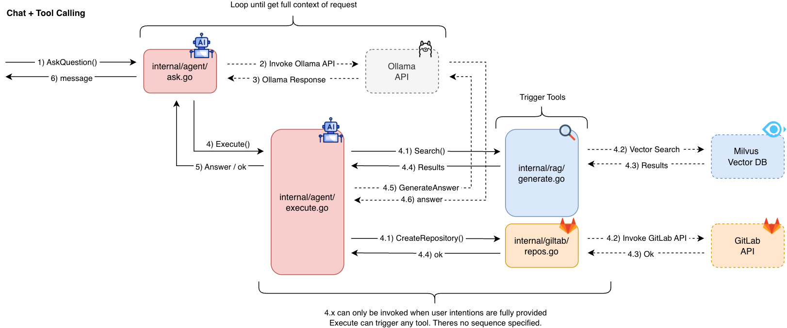
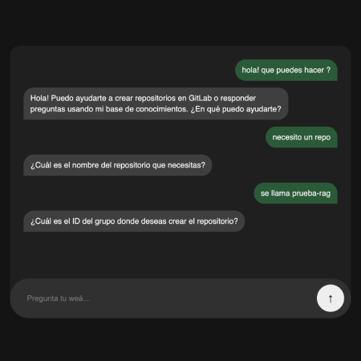

# RAG ChatBot + DevOps Tool Calling

Have you ever worked on tech? If so you'll agree large companies have serious problems with burocracy, tickets, documentation and internal chaos in general. This is were this project comes in. This code base consist on a RAG + Tool Calling powered ChatBot which is able to respond questions and trigger remote APIs.

## Proposal

As mentioned before, the proposal is having a centralized chatbot (LLM) to manage questions and eventually handle Jira Ticket, Git Repositories, Zoom Meetings, Trigger Remote Jobs, Request for IT Support, you name it. As long as the service has an API the possibility exists.

### How does it work?

This is a GoLang project based on Gin, Ollama, Milvus, and Vue.js. It provides a web application which serves a chatbot instance. All requests are sent to an LLM Agent programmed to attend user's needs. In this example project, the Agent can only create GitLab repositories by requesting the repository name and group ID.

If the agent cannot answer a question (for example, something unrelated to creating GitLab repositories), it calls the RAG system to perform a vector search in Milvus (database) and then returns the output context to generate a response.

### Requirements

- go 1.24.9
- nodejs 22.16.0
- npm 11.3.0
- ollama 0.12.8
- milvus-io 2.6.4
- gnu-make 3.81
- docker 28.2

## Quick Start

### 1. Prepare your environment

- Make sure docker daemon is running on your machine (https://docs.docker.com/get-started/)
- Install and serve ollama api (https://ollama.com/)
- Rename `sample.env` as `.env` and fullfil with your parameters

### 2. Install Ollama Models

The following models are being used:

- embeddinggemma:300m for embedings
- qwen3:14b for chatbot + tool calling
- gemma3:4b for generate answers

However, they had been "modified" to behave according their rol.
Please take a look at `model/` and edit them if needed.  
**Make sure to set `RESPONSES IN` to your desired language.**

Once satisfied, install them

    make ollama

Run ollama

    ollama serve

### 3. Build Application

This project has two ways to be distributed usinge Docker Containers. I recommend building and deploying using the following commands so you can make sure all important dependecies are satisfied in your environment: go, vue, milvus.

    make docker-build
    make docker-compose

### 4. Populate RAG

While Docker Compose is running. Put your PDFs into `docker/volumes/ragbot`, RAG instance will retrive all PDFs from there.

    make docker-embed

### 5. Consume WebService

Visit http://localhost:8080 to consume ChatBot Service

## Relevant Notes

- [Project Structure](docs/pages/arch.md)
- [Consuming REST Api](docs/pages/api.md)
- [Building From Source](docs/pages/build.md)
- [Develop Environment](docs/pages/dev.md)
- [F.A.Q](docs/pages/faq.md)