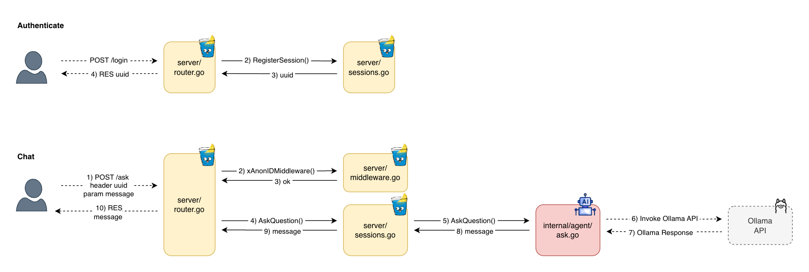
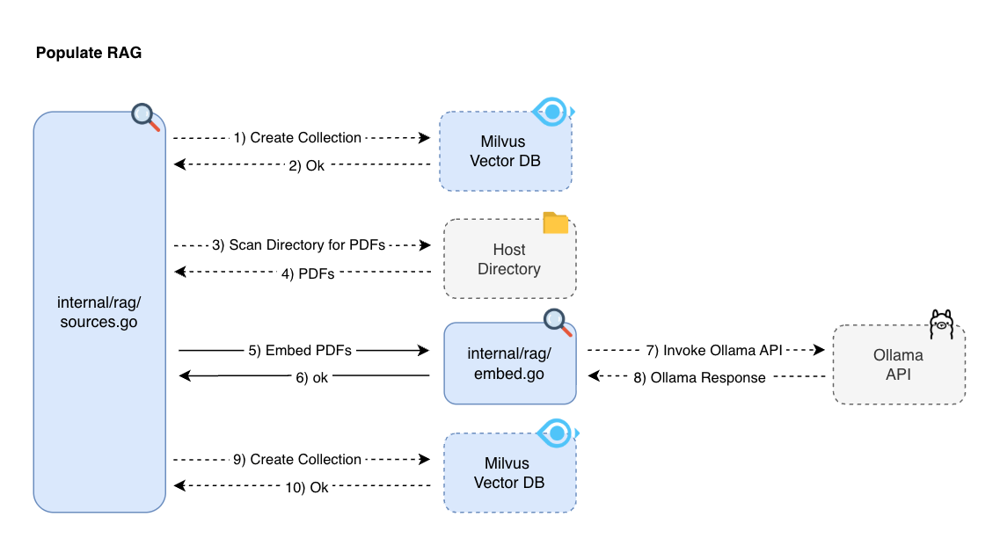

# Project Structure

While I'm having some inconsistencies I'm trying to follow some common [Go Project Structure](https://github.com/golang-standards/project-layout). So far I have the following folder set:

    docker/             -> all related to docker containers and compose file
    model/              -> ollama models with some instructions
    src/                -> source code of the application
    ├── cmd/            -> basically just de main.go for launching application
    ├── internal/       -> connectors to apis (gitlab, ollama, milvus)
    ├── public/         -> just the `vue.js` frontend and the `embed.FS` for storign the web page inside the binary file
    └── server/         -> gin gonic routers and middleware
    test/               -> some test cases for go app

## Hierarchy

Depending on how are you serving your application they may be different services and instances to create. But a general hierarchy is the following:

### Chat Via HTTP Server

### RAG / Tool Calling

### RAG Populate
